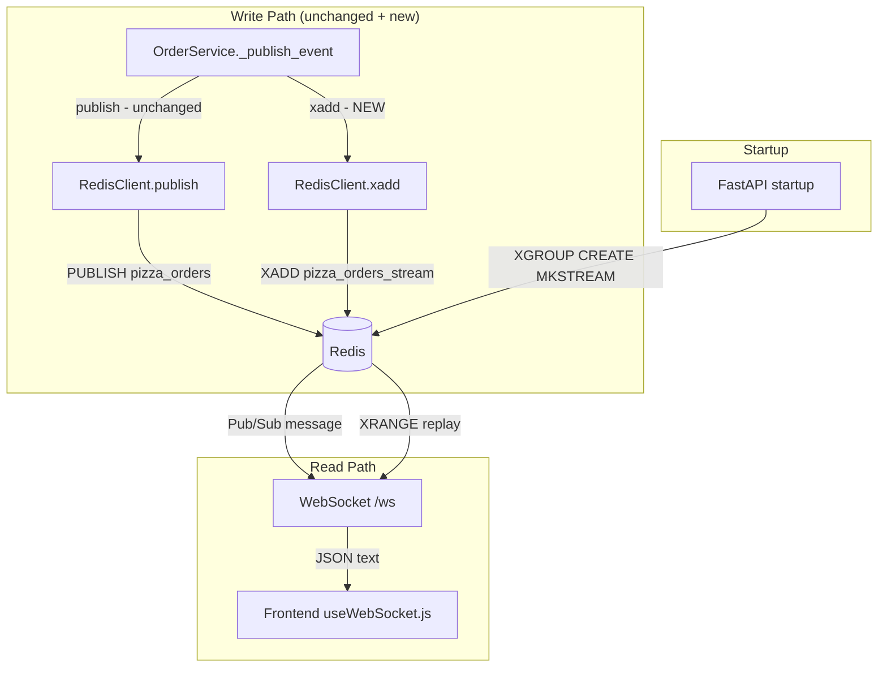

# Design Document: Redis Streams Migration

## Overview

This feature adds Redis Streams as a parallel, persistent event log alongside the existing Redis Pub/Sub infrastructure in the pizza delivery marketplace backend. The change is purely additive: no existing code paths are removed or altered. Every order lifecycle event will be dual-written — published on the `pizza_orders` Pub/Sub channel (as today) and appended to the `pizza_orders_stream` Redis Stream. The WebSocket bridge gains an optional `last_event_id` query parameter that triggers a replay of missed events before resuming live Pub/Sub delivery.

The stack is FastAPI + Python with `redis.asyncio`.

---

## Architecture



The key invariant: `RedisClient.publish` and `RedisClient.subscribe` are never touched. All new behaviour lives in new methods (`xadd`, `xreadgroup`, `xack`, `xrange`) and in the modified `OrderService._publish_event` and `main.py` WebSocket handler.

---

## Components and Interfaces

### RedisClient (redis_client.py)

Four new coroutines are added. Existing methods are unchanged.

```python
async def xadd(self, stream: str, message: str) -> str:
    """Append message (JSON string) to stream under field key 'data'.
    Uses MAXLEN ~ settings.stream_max_len for approximate trimming.
    Returns the auto-generated Entry_ID."""

async def xreadgroup(
    self,
    stream: str,
    group: str,
    consumer: str,
    count: int = 10,
    block: int = 1000,
) -> list[dict]:
    """Read up to `count` undelivered messages from the consumer group.
    Blocks for `block` ms if no messages are available.
    Returns list of dicts with keys 'id' and 'data' (deserialized)."""

async def xack(self, stream: str, group: str, entry_id: str) -> None:
    """Acknowledge a processed stream entry."""

async def xrange(
    self,
    stream: str,
    start: str = "-",
    end: str = "+",
    count: int = None,
) -> list[dict]:
    """Return entries from stream between start and end Entry_IDs.
    Returns list of dicts with keys 'id' and 'data' (deserialized)."""
```

Startup addition in `connect()`:

```python
async def _ensure_consumer_group(self):
    """Create pizza_consumers group on pizza_orders_stream if not present."""
    try:
        await self.client.xgroup_create(
            STREAM_NAME, GROUP_NAME, id="$", mkstream=True
        )
    except redis.exceptions.ResponseError as e:
        if "BUSYGROUP" not in str(e):
            raise
```

Constants (module-level in `redis_client.py`):

```python
STREAM_NAME = "pizza_orders_stream"
GROUP_NAME  = "pizza_consumers"
```

### OrderService (services/order_service.py)

`_publish_event` is extended to dual-write. The Pub/Sub call is unchanged; the `xadd` call is fire-and-forget with error isolation:

```python
async def _publish_event(self, event: OrderEvent):
    payload = json.dumps(event.model_dump(mode='json'), default=str)
    # Existing Pub/Sub — unchanged
    await self.redis.publish("pizza_orders", payload)
    # New: persist to stream, non-blocking on failure
    try:
        await self.redis.xadd(STREAM_NAME, payload)
    except Exception as e:
        print(f"⚠️  Stream write failed (non-blocking): {e}")
```

`dispatch_events` follows the same pattern: each event is published then streamed; a stream failure logs and continues.

### WebSocket Bridge (main.py)

The `/ws` endpoint gains an optional query parameter:

```python
@app.websocket("/ws")
async def websocket_endpoint(
    websocket: WebSocket,
    last_event_id: str | None = None,
):
```

Behaviour:
1. If `last_event_id` is present → call `redis_client.xrange(STREAM_NAME, start=last_event_id, end="+")` and send each entry as JSON text.
2. Switch to the existing Pub/Sub loop (unchanged).

The replay entries are sent in the same JSON format the frontend already expects (the `data` field is already the deserialized event dict, re-serialized to text).

---

## Data Models

No new Pydantic models are required. Stream entries are plain dicts returned by `xrange` / `xreadgroup`.

### Stream Entry Wire Format

Redis stores each entry as a hash with a single field:

| Field | Type   | Value                                      |
|-------|--------|--------------------------------------------|
| data  | string | JSON-serialized `OrderEvent.model_dump()`  |

Example raw Redis entry:

```
1700000000000-0  data  {"event_type":"order.created","order":{...},"timestamp":"..."}
```

### Configuration

New key added to `config.py` `Settings`:

```python
stream_max_len: int = Field(default=10000, env="STREAM_MAX_LEN")
```

### Serialization Contract

- **Write**: `json.dumps(event.model_dump(mode='json'), default=str)` → stored as `data` field.
- **Read**: `json.loads(entry["data"])` → returns the original dict.
- Round-trip: `json.loads(json.dumps(obj, default=str)) == obj` for all `OrderEvent` payloads (datetimes serialized as ISO strings).

---

## Correctness Properties

*A property is a characteristic or behavior that should hold true across all valid executions of a system — essentially, a formal statement about what the system should do. Properties serve as the bridge between human-readable specifications and machine-verifiable correctness guarantees.*

### Property 1: Pub/Sub delivery is unaffected by stream write outcome

*For any* order lifecycle event, calling `_publish_event` should deliver the event to all active Pub/Sub subscribers and complete without raising an exception, regardless of whether the `xadd` call succeeds or fails.

**Validates: Requirements 1.3, 5.4**

### Property 2: Serialization round-trip

*For any* valid `OrderEvent` dict, serializing it to a JSON string and then deserializing it should produce an equal dict.

**Validates: Requirements 7.3**

### Property 3: xrange returns entries in insertion order

*For any* sequence of events appended to the stream, `xrange` with `start="-"` should return them in the same order they were appended (monotonically increasing Entry_IDs).

**Validates: Requirements 6.1, 6.2**

### Property 4: xrange with start ID excludes prior entries

*For any* stream and any valid Entry_ID `E` present in the stream, `xrange(start=E)` should return only entries with ID greater than or equal to `E`, and never entries that precede `E`.

**Validates: Requirements 6.1, 8.1**

### Property 5: Consumer group creation is idempotent

*For any* number of calls to `_ensure_consumer_group`, the result should be that exactly one consumer group named `pizza_consumers` exists on `pizza_orders_stream` and no error is raised.

**Validates: Requirements 4.1, 4.3**

### Property 6: Dual-write completeness

*For any* order lifecycle event published via `_publish_event` or `dispatch_events`, both `publish` (Pub/Sub) and `xadd` (Stream) should be called, and the stream should contain an entry whose `data` field deserializes to an equal event dict.

**Validates: Requirements 5.1, 5.2, 5.3**

### Property 7: WebSocket replay then live

*For any* WebSocket connection with a valid `last_event_id`, the sequence of messages received by the client should be: all stream entries after `last_event_id` (in order, in the same JSON format as live events), followed by live Pub/Sub events.

**Validates: Requirements 8.1, 8.3, 8.4**

### Property 8: Malformed stream entry raises ValueError

*For any* stream entry whose `data` field is not valid JSON, calling `xreadgroup` or `xrange` should raise a `ValueError` with a descriptive message identifying the entry.

**Validates: Requirements 7.4**

### Property 9: xack prevents redelivery

*For any* stream entry that has been delivered to a consumer and acknowledged via `xack`, subsequent calls to `xreadgroup` on the same consumer group should not return that entry again.

**Validates: Requirements 3.4, 3.5**

### Property 10: xrange respects count limit

*For any* stream with N entries and a count limit C where C < N, `xrange` with that count should return exactly C entries.

**Validates: Requirements 6.3**

### Property 11: MAXLEN trimming bounds stream length

*For any* stream configured with `MAXLEN ~ M`, after inserting significantly more than M entries, the stream length should remain approximately bounded at M (within Redis approximate trimming tolerance).

**Validates: Requirements 2.4, 2.5**

---

## Error Handling

| Scenario | Behaviour |
|---|---|
| `xadd` fails (network, OOM, etc.) | Log warning, continue. Pub/Sub delivery is unaffected. |
| `xrange` called with unknown `last_event_id` | Standard Redis `XRANGE` behaviour: returns entries with ID > provided value. No error raised. |
| `BUSYGROUP` on `XGROUP CREATE` at startup | Silently ignored — group already exists. |
| Any other `XGROUP CREATE` error at startup | Re-raised — prevents startup with misconfigured Redis. |
| `data` field not valid JSON in stream entry | `ValueError` raised with entry ID in message. |
| WebSocket disconnects during replay | `WebSocketDisconnect` caught as today; pubsub unsubscribed and closed. |

---

## Testing Strategy

### Unit Tests

Focus on specific examples and error conditions:

- `test_xadd_stores_data_field`: verify the `data` field is present and is valid JSON after `xadd`.
- `test_xrange_returns_ordered_entries`: append 3 events, assert `xrange` returns them in insertion order.
- `test_xrange_with_start_id_excludes_prior`: append events, replay from middle ID, assert first entries absent.
- `test_ensure_consumer_group_idempotent`: call `_ensure_consumer_group` twice, assert no error and one group exists.
- `test_publish_event_dual_writes`: mock both `publish` and `xadd`, call `_publish_event`, assert both called.
- `test_stream_failure_non_blocking`: mock `xadd` to raise, call `_publish_event`, assert `publish` still called and no exception raised.
- `test_malformed_data_raises_value_error`: insert raw entry with non-JSON `data`, call `xrange`, assert `ValueError`.
- `test_websocket_no_last_event_id_unchanged`: connect without param, assert only Pub/Sub path used.
- `test_websocket_with_last_event_id_replays`: seed stream, connect with `last_event_id`, assert replay messages received before live events.

### Property-Based Tests

Using [Hypothesis](https://hypothesis.readthedocs.io/) (already compatible with pytest).

Each property test runs a minimum of 100 iterations.

**Tag format**: `# Feature: redis-streams-migration, Property {N}: {property_text}`

```python
# Feature: redis-streams-migration, Property 3: Serialization round-trip
@given(st.fixed_dictionaries({...}))
@settings(max_examples=100)
def test_serialization_round_trip(event_dict):
    serialized = json.dumps(event_dict, default=str)
    assert json.loads(serialized) == event_dict
```

| Property | Test name | Hypothesis strategy |
|---|---|---|
| P1: Pub/Sub unaffected by stream write outcome | `test_prop_pubsub_unaffected` | `st.text()` payloads, mock `xadd` to randomly raise or succeed |
| P2: Serialization round-trip | `test_prop_serialization_round_trip` | `st.builds(OrderEvent, ...)` |
| P3: xrange returns entries in order | `test_prop_xrange_ordered` | `st.lists(st.text(), min_size=1)` for event payloads |
| P4: xrange with start excludes prior | `test_prop_xrange_start_excludes_prior` | `st.lists(st.text(), min_size=2)` |
| P5: Consumer group creation idempotent | `test_prop_consumer_group_idempotent` | `st.integers(min_value=1, max_value=10)` for call count |
| P6: Dual-write completeness | `test_prop_dual_write_completeness` | `st.builds(OrderEvent, ...)` |
| P7: WebSocket replay then live | `test_prop_websocket_replay_then_live` | `st.lists(st.builds(OrderEvent, ...), min_size=1)` |
| P8: Malformed entry raises ValueError | `test_prop_malformed_entry_raises` | `st.text().filter(lambda s: not is_valid_json(s))` |
| P9: xack prevents redelivery | `test_prop_xack_prevents_redelivery` | `st.lists(st.text(), min_size=1)` for entry payloads |
| P10: xrange respects count limit | `test_prop_xrange_count_limit` | `st.integers(min_value=1)` for count, `st.lists(st.text())` for entries |
| P11: MAXLEN trimming bounds stream length | `test_prop_maxlen_bounds_stream` | `st.integers(min_value=10, max_value=100)` for MAXLEN |

Each property-based test must be implemented as a single test function referencing the design property in a comment.
