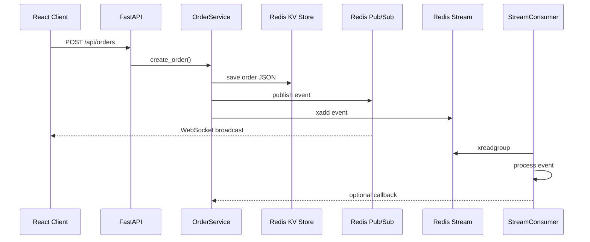
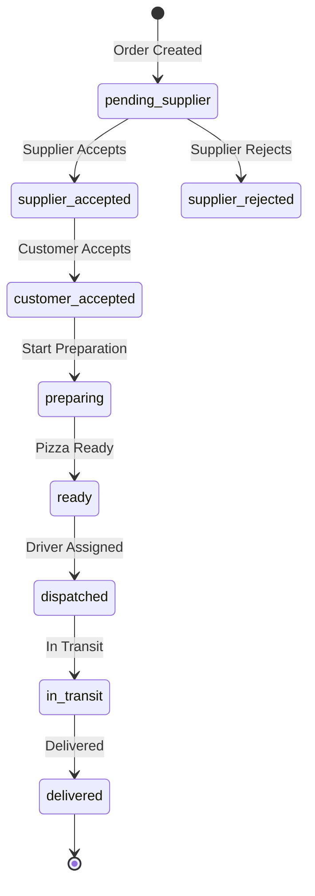

# Event-Driven Pizza Delivery Platform

A **real-time, event-driven order management system** demonstrating enterprise-grade architectural patterns with React, FastAPI, and Redis Cloud. Supports a complete pizza delivery lifecycle across **Supplier**, **Customer**, and **Dispatch** roles with live WebSocket synchronization, Redis Streams for event persistence, and Grafana-exportable metrics.

---

## Architecture Overview

```mermaid
graph TB
    subgraph Frontend["React Frontend (Vite)"]
        SP[SupplierPanel]
        CP[CustomerPanel]
        DP[DispatchPanel]
        OP[OrdersPanel]
        DT[DeliveryTracker]
        SD[SystemDashboard]
        WS[useWebSocket Hook]
    end

    subgraph Backend["FastAPI Backend (Python 3.11+)"]
        API[REST API Endpoints]
        WS_EP[WebSocket /ws]
        OS[OrderService]
        DS[DeliveryService]
        SS[StateService<br/>+ CachedStateService]
        MS[MetricsService]
        SC[StreamConsumer]
    end

    subgraph Redis["Redis Cloud"]
        KV[Key-Value Store<br/>order:{uuid} -> JSON]
        PS[Pub/Sub Channel<br/>pizza_orders]
        ST[Stream<br/>pizza_orders_stream]
        CA[Cache<br/>state_cache:*]
    end

    subgraph Monitoring["Monitoring"]
        GF[Grafana Dashboard]
        PM[Prometheus Metrics<br/>/metrics]
        JM[JSON Metrics<br/>/api/metrics]
    end

    SP -->|REST| API
    CP -->|REST| API
    DP -->|REST| API
    OP -->|REST| API
    DT -->|REST| API
    WS --- WS_EP

    API --> OS
    API --> DS
    API --> SS
    API --> MS

    OS --> KV
    OS --> PS
    OS --> ST
    SS --> CA
    SS --> KV
    MS --> KV
    SC --> ST

    WS_EP --> PS

    MS --> PM
    MS --> JM
    PM --> GF
    JM --> GF

    SC -.->|Async Processing| OS
```

### Event Flow



### Order State Machine



---

## Why This Architecture Matters

| Pattern | Implementation | Benefit |
|---------|---------------|---------|
| **Event-Driven** | Redis Pub/Sub + Streams dual-write | Decoupled services, async processing, audit trail |
| **CQRS-ish** | Separate read (KV get) / write (event publish) paths | Optimized for different access patterns |
| **Cache-Aside** | CachedStateService with 5s TTL | Reduces Redis load for repeated state queries |
| **Consumer Groups** | Redis Streams xreadgroup | Guaranteed processing, auto-restart, horizontal scale |
| **Dual-Write** | Event → Pub/Sub (instant) + Streams (persistent) | Real-time UI + durable event log |
| **Batch Processing** | Atomic event batches with rollback | Transactional consistency for multi-event operations |

---

## Tech Stack

| Layer | Technology | Purpose |
|-------|-----------|---------|
| **Frontend** | React 18 + Vite 6 | SPA with hooks-based architecture |
| **Real-Time** | Native WebSocket API | Bidirectional live updates |
| **Backend** | FastAPI (async) | High-performance REST + WebSocket |
| **Data Layer** | Redis Cloud (KV + Pub/Sub + Streams) | Storage, messaging, event sourcing |
| **Validation** | Pydantic v2 | Runtime type safety |
| **Monitoring** | Prometheus + JSON endpoints | Grafana dashboard integration |
| **CI/CD** | GitHub Actions | Multi-Python matrix testing, security scanning |
| **Testing** | pytest + pytest-asyncio + httpx | Async test fixtures with mocked Redis |

---

## Project Structure

```
├── backend/
│   ├── main.py                          # FastAPI app: 13 REST endpoints + WebSocket
│   ├── models.py                        # 9 Pydantic models (PizzaOrder, OrderEvent, etc.)
│   ├── config.py                        # pydantic-settings (.env -> config)
│   ├── redis_client.py                  # Async Redis wrapper (KV, Pub/Sub, Streams)
│   ├── services/
│   │   ├── order_service.py             # Order lifecycle, event publishing, batch dispatch
│   │   ├── delivery_service.py          # Tracking info, progress %, ETA, timeline
│   │   ├── state_service.py             # System state aggregation + caching layer
│   │   ├── metrics_service.py           # Prometheus + JSON metrics for Grafana
│   │   └── stream_consumer.py           # Redis Streams consumer group processor
│   └── tests/                           # 12 test files, mocked Redis, full coverage
├── frontend/
│   ├── src/
│   │   ├── App.jsx                      # Root: view switching, global state via WebSocket
│   │   ├── hooks/useWebSocket.js        # Auto-reconnect WebSocket hook
│   │   └── components/
│   │       ├── SupplierPanel.jsx        # Create + accept/reject orders
│   │       ├── CustomerPanel.jsx        # Browse + accept with delivery details
│   │       ├── DispatchPanel.jsx        # Assign drivers to ready orders
│   │       ├── OrdersPanel.jsx          # Full order list + status controls
│   │       ├── DeliveryTracker.jsx      # Modal: progress stepper, ETA, driver card
│   │       └── SystemDashboard.jsx      # Stats, status breakdown, active drivers
├── grafana/
│   └── dashboard-orders-delivered.json  # Pre-built dashboard (7 panels)
└── .github/workflows/
    ├── ci.yml                           # Security scan, tests (py3.11/3.12), lint, build
    ├── deploy.yml                       # Staging/production deployment
    └── secret-scan.yml                  # GitGuardian, Gitleaks, TruffleHog
```

---

## Quick Start

```bash
# Backend
cd backend
python -m venv venv && source venv/bin/activate
pip install -r requirements.txt
cp .env.example .env   # Add your Redis Cloud credentials
uvicorn main:app --reload     # → http://localhost:8000

# Frontend (separate terminal)
cd frontend
npm install
npm run dev                   # → http://localhost:5173

# API docs
open http://localhost:8000/docs
```

---

## API Endpoints

| Method | Path | Description |
|--------|------|-------------|
| `POST` | `/api/orders` | Create a new pizza order |
| `POST` | `/api/orders/{id}/supplier-respond` | Supplier accepts/rejects |
| `POST` | `/api/orders/{id}/customer-accept` | Customer accepts with details |
| `POST` | `/api/orders/{id}/dispatch` | Assign driver to ready order |
| `POST` | `/api/orders/{id}/status` | Update status (preparing/ready/in_transit/delivered) |
| `GET` | `/api/orders` | List all orders |
| `GET` | `/api/orders/{id}/delivery` | Delivery tracking info |
| `GET` | `/api/track/{tracking_id}` | Public tracking by human-readable ID |
| `GET` | `/api/state` | Full system state (cached) |
| `POST` | `/api/events/batch` | Atomic batch event dispatch |
| `GET` | `/api/metrics` | JSON metrics for Grafana |
| `GET` | `/metrics` | Prometheus-format metrics |
| `WS` | `/ws` | Real-time event stream |

---

## Key Engineering Decisions

### Dual-Write: Pub/Sub + Streams
Every event is both **published** to Redis Pub/Sub (delivered instantly to all WebSocket clients) and **appended** to a Redis Stream (persisted for replay, consumer group processing, and audit). This gives you real-time UI updates *and* durable event sourcing.

### Layered Service Architecture
Controllers in `main.py` are thin — they delegate to focused service classes (`OrderService`, `DeliveryService`, etc.). This keeps endpoints testable and separates concerns cleanly.

### CachedStateService (Decorator Pattern)
A `CachedStateService` wraps `StateService` with a Redis-backed cache (5-second TTL). The `/api/state` endpoint never directly scans all `order:*` keys on every request — it reads from cache, falling back to a fresh scan only on cache miss.

### StreamConsumer with Auto-Restart
The `StreamConsumer` uses Redis consumer groups for reliable event processing. If the processor crashes or encounters an error, it logs the issue, waits 5 seconds, and **automatically restarts** — no manual intervention needed.

### Batch Events with Rollback
The `/api/events/batch` endpoint processes multiple events atomically. If *any* event in the batch fails, a `batch.rollback` event is published with the `correlation_id` so downstream systems can compensate — a lightweight saga pattern.

### Metrics in Two Formats
`MetricsService` produces both **Prometheus exposition format** (`/metrics`) and **structured JSON** (`/api/metrics`), making it compatible with both Prometheus and the Grafana JSON datasource. The included `grafana/dashboard-orders-delivered.json` has 7 pre-configured panels.

---

## Testing

```bash
cd backend
pytest tests/ -v --cov=. --cov-report=term
```

Tests use a fully **mocked Redis client** (in-memory dict-based storage), so no external Redis instance is needed. Coverage includes: models, order service, all API endpoints, delivery tracking, event batching, Redis Streams integration, and system state caching.

---

## Deployment

Deploy free-tier:
- **Backend**: Render / Railway (FastAPI + Uvicorn)
- **Frontend**: Vercel / Netlify (Vite build output)
- **Database**: Redis Cloud (free 30 MB tier)

See [docs/FREE-TIER-DEPLOYMENT.md](docs/FREE-TIER-DEPLOYMENT.md) for detailed instructions.

---

## Monitoring

The Grafana dashboard at `grafana/dashboard-orders-delivered.json` provides:
- Real-time delivery statistics (total, active, completed today)
- Delivery rate gauge (percentage of orders delivered)
- Time-series trends (today, 7 days, 30 days)
- Supplier performance breakdown (bar chart)
- Driver performance analytics
- Hourly delivery distribution (heatmap-ready data)

---

## Author

**Tukue Gebremariam Gebregergis**
- [GitHub](https://github.com/tukue)
- [LinkedIn](https://www.linkedin.com/in/tukuegebremariam/)

---

**License**: MIT
