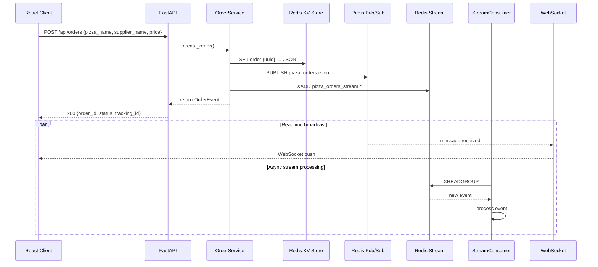
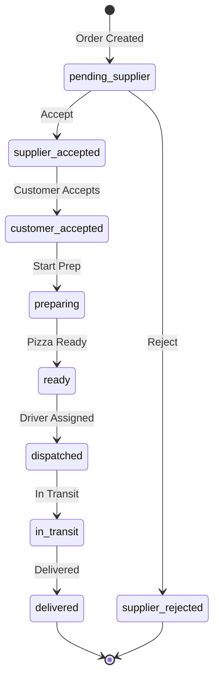

# Event-Driven Pizza Delivery Platform

A **real-time, event-driven order management marketplace** demonstrating enterprise-grade architectural patterns with React, FastAPI, and Redis Cloud. Supports a complete pizza delivery lifecycle across **Supplier**, **Customer**, and **Dispatch** roles with live WebSocket synchronization, Redis Streams for event persistence, and Grafana-exportable metrics.

---

## Business Problem

Small and medium pizza businesses lack affordable, real-time order management systems. Existing solutions are either:

- **Monolithic POS systems** — expensive, closed, single-location only
- **Generic delivery apps** — take 20-30% commission per order, no supplier-branding control
- **Manual workflows** — phone/paper-based, error-prone, no visibility

This platform demonstrates how **event-driven architecture** solves marketplace coordination challenges: three independent roles (supplier, customer, dispatch) need to observe and react to the same order state in real-time without tight coupling. Redis Pub/Sub provides instant broadcast, Redis Streams provides durable audit, and the dual-write pattern gives both without sacrificing either.

---

## Architecture Overview

The system follows a **layered, event-driven architecture** with four tiers:

| Layer | Technology | Responsibility |
|-------|-----------|---------------|
| **Presentation** | React 18 + Vite 6 | UI components per role, WebSocket for live updates |
| **API / Gateway** | FastAPI (ASGI) | REST endpoints + WebSocket server, request validation |
| **Service / Domain** | Python services | Order lifecycle, delivery tracking, state aggregation, metrics, stream processing |
| **Data / Messaging** | Redis Cloud | KV storage, Pub/Sub, Streams, cache (4 concerns, 1 infra) |

### Component Diagram

```mermaid
graph TB
    classDef frontend fill:#1a1a2e,stroke:#e94560,color:#fff
    classDef backend fill:#16213e,stroke:#0f3460,color:#fff
    classDef redis fill:#1a1a2e,stroke:#e94560,color:#fff
    classDef monitor fill:#16213e,stroke:#0f3460,color:#fff
    classDef note fill:#2d2d2d,stroke:#666,color:#ccc,stroke-dasharray: 5 5

    subgraph Frontend["Presentation Layer — React SPA (Vite)"]
        SP["SupplierPanel<br/><i>create, accept, reject</i>"]
        CP["CustomerPanel<br/><i>browse, accept orders</i>"]
        DP["DispatchPanel<br/><i>assign drivers</i>"]
        OP["OrdersPanel<br/><i>status controls</i>"]
        DT["DeliveryTracker<br/><i>progress stepper, ETA</i>"]
        SD["SystemDashboard<br/><i>stats, active drivers</i>"]
        WS["useWebSocket<br/><i>auto-reconnect hook</i>"]
    end

    subgraph Backend["Service Layer — FastAPI (Python 3.11+)"]
        API["REST Controllers<br/><i>13 endpoints</i>"]
        WSEP["WebSocket /ws<br/><i>Pub/Sub → client</i>"]
        OS["OrderService<br/><i>state machine, CRUD</i>"]
        DS["DeliveryService<br/><i>ETA, progress, timeline</i>"]
        SS["CachedStateService<br/><i>5s TTL cache-aside</i>"]
        MS["MetricsService<br/><i>Prometheus + JSON</i>"]
        SC["StreamConsumer<br/><i>consumer group processor</i>"]
    end

    subgraph Redis["Data & Messaging Layer — Redis Cloud"]
        KV[("KV Store<br/><i>order:{uuid} → JSON</i>")]
        PS[("Pub/Sub<br/><i>pizza_orders channel</i>")]
        ST[("Streams<br/><i>pizza_orders_stream</i>")]
        CA[("Cache<br/><i>state_cache:* (5s TTL)</i>")]
    end

    subgraph Monitoring["Monitoring Layer"]
        GF["Grafana Dashboard<br/><i>7 pre-built panels</i>"]
        PM["/metrics<br/><i>Prometheus format</i>"]
        JM["/api/metrics<br/><i>JSON format</i>"]
    end

    SP -->|"POST/GET"| API
    CP -->|"POST/GET"| API
    DP -->|"POST/GET"| API
    OP -->|"POST/GET"| API
    DT -->|"GET"| API
    WS -->|"ws://"| WSEP

    API -->|delegates| OS
    API -->|delegates| DS
    API -->|delegates| SS
    API -->|delegates| MS

    OS -->|"save/read"| KV
    OS -->|"publish"| PS
    OS -->|"xadd"| ST
    SS -->|"cache get/set"| CA
    SS -->|"scan orders"| KV
    MS -->|"aggregate"| KV
    SC -->|"xreadgroup"| ST
    SC -->|"callback"| OS

    WSEP -->|"subscribe"| PS

    MS -->|"expose"| PM
    MS -->|"expose"| JM
    PM -->|"scrape"| GF
    JM -->|"query"| GF

    SC -.->|"auto-restart on error"| SC
```



### Event Flow (Order Creation)



### Order State Machine



### Data Flow Patterns

| Flow | Triggers | Path | Latency |
|------|----------|------|---------|
| **Command** | User action (POST) | Client → REST → Service → Redis KV | ~5-20ms |
| **Real-time event** | State change | Service → Pub/Sub → WebSocket → Client | ~2-10ms |
| **Durable event** | State change | Service → Stream → Consumer Group → Handler | ~10-50ms |
| **State query** | GET /api/state | Client → REST → CacheService → Redis Cache (or KV fallback) | ~2-5ms cached, ~20-50ms miss |

---

## Why This Architecture Matters

| Pattern | Implementation | Benefit |
|---------|---------------|---------|
| **Event-Driven** | Redis Pub/Sub + Streams dual-write | Decoupled services, async processing, audit trail |
| **CQRS-ish** | Separate read (KV get) / write (event publish) paths | Optimized for different access patterns |
| **Cache-Aside** | CachedStateService with 5s TTL | Reduces Redis load for repeated state queries |
| **Consumer Groups** | Redis Streams xreadgroup | Guaranteed processing, auto-restart, horizontal scale |
| **Dual-Write** | Event → Pub/Sub (instant) + Streams (persistent) | Real-time UI + durable event log |
| **Batch Processing** | Atomic event batches with rollback | Transactional consistency for multi-event operations |

---

## Design Considerations & Tradeoffs

| Decision | Rationale | Tradeoff |
|----------|-----------|----------|
| **Redis as single datastore** | KV + Pub/Sub + Streams + Cache in one system simplifies operations | Single point of failure; no relational queries; manual index management via key conventions |
| **Dual-write (Pub/Sub + Streams)** | Instant broadcast for live UI + durable log for replay/audit | Every event written twice; if one path fails, state can drift (mitigated by KV as source of truth) |
| **Polling WebSocket loop** | Simple implementation with `get_message(timeout=1.0)` polling at 10ms intervals | Wastes CPU cycles vs push-based callbacks; acceptable for demo scale |
| **In-memory mocked tests** | Zero-infrastructure CI; runs in seconds; deterministic | Cannot catch Redis-specific failures (connection drops, stream trim, race conditions) |
| **Cache-aside with 5s TTL** | Drastically reduces `KEYS` scans on state queries | `/api/state` is potentially 5s stale; acceptable for dashboard use cases |
| **No auth / no persistence layer besides Redis** | Keeps demo simple to set up and understand | Not production-ready; orders lost on Redis flush; no user isolation |
| **Python async + FastAPI** | Excellent for I/O-bound workloads (Redis calls, WebSocket connections) | GIL-bound CPU work blocks event loop; not suitable for heavy computation |
| **Saga via rollback events** | Lightweight compensation for failed batches without distributed transactions | Best-effort only; no guaranteed compensation if rollback itself fails |

---

## Tech Stack

| Layer | Technology | Purpose |
|-------|-----------|---------|
| **Frontend** | React 18 + Vite 6 | SPA with hooks-based architecture |
| **Real-Time** | Native WebSocket API | Bidirectional live updates |
| **Backend** | FastAPI (async) | High-performance REST + WebSocket |
| **Data Layer** | Redis Cloud (KV + Pub/Sub + Streams) | Storage, messaging, event sourcing |
| **Validation** | Pydantic v2 | Runtime type safety |
| **Monitoring** | Prometheus + JSON endpoints | Grafana dashboard integration |
| **CI/CD** | GitHub Actions | Multi-Python matrix testing, security scanning |
| **Testing** | pytest + pytest-asyncio + httpx | Async test fixtures with mocked Redis |

---

## Project Structure

```
├── backend/
│   ├── main.py                          # FastAPI app: 13 REST endpoints + WebSocket
│   ├── models.py                        # 9 Pydantic models (PizzaOrder, OrderEvent, etc.)
│   ├── config.py                        # pydantic-settings (.env -> config)
│   ├── redis_client.py                  # Async Redis wrapper (KV, Pub/Sub, Streams)
│   ├── services/
│   │   ├── order_service.py             # Order lifecycle, event publishing, batch dispatch
│   │   ├── delivery_service.py          # Tracking info, progress %, ETA, timeline
│   │   ├── state_service.py             # System state aggregation + caching layer
│   │   ├── metrics_service.py           # Prometheus + JSON metrics for Grafana
│   │   └── stream_consumer.py           # Redis Streams consumer group processor
│   └── tests/                           # 12 test files, mocked Redis, full coverage
├── frontend/
│   ├── src/
│   │   ├── App.jsx                      # Root: view switching, global state via WebSocket
│   │   ├── hooks/useWebSocket.js        # Auto-reconnect WebSocket hook
│   │   └── components/
│   │       ├── SupplierPanel.jsx        # Create + accept/reject orders
│   │       ├── CustomerPanel.jsx        # Browse + accept with delivery details
│   │       ├── DispatchPanel.jsx        # Assign drivers to ready orders
│   │       ├── OrdersPanel.jsx          # Full order list + status controls
│   │       ├── DeliveryTracker.jsx      # Modal: progress stepper, ETA, driver card
│   │       └── SystemDashboard.jsx      # Stats, status breakdown, active drivers
├── grafana/
│   └── dashboard-orders-delivered.json  # Pre-built dashboard (7 panels)
└── .github/workflows/
    ├── ci.yml                           # Security scan, tests (py3.11/3.12), lint, build
    ├── deploy.yml                       # Staging/production deployment
    └── secret-scan.yml                  # GitGuardian, Gitleaks, TruffleHog
```

---

## Quick Start

**Configure API base URL:**

The frontend reads the backend URL from the `VITE_API_URL` environment variable (defaults to `http://localhost:8000`):

```bash
# Optional: point frontend at a different backend
export VITE_API_URL=https://your-backend.com
```

**Run locally:**

```bash
# Backend
cd backend
python -m venv venv && source venv/bin/activate
pip install -r requirements.txt
cp .env.example .env   # Add your Redis Cloud credentials + configure CORS_ALLOW_ORIGINS
uvicorn main:app --reload     # → http://localhost:8000

# Frontend (separate terminal)
cd frontend
npm install
npm run dev                   # → http://localhost:5173

# API docs
open http://localhost:8000/docs
```

---

## API Endpoints

| Method | Path | Description |
|--------|------|-------------|
| `POST` | `/api/orders` | Create a new pizza order |
| `POST` | `/api/orders/{id}/supplier-respond` | Supplier accepts/rejects |
| `POST` | `/api/orders/{id}/customer-accept` | Customer accepts with details |
| `POST` | `/api/orders/{id}/dispatch` | Assign driver to ready order |
| `POST` | `/api/orders/{id}/status` | Update status (preparing/ready/in_transit/delivered) |
| `GET` | `/api/orders` | List all orders |
| `GET` | `/api/orders/{id}/delivery` | Delivery tracking info |
| `GET` | `/api/track/{tracking_id}` | Public tracking by human-readable ID |
| `GET` | `/api/state` | Full system state (cached) |
| `POST` | `/api/events/batch` | Atomic batch event dispatch |
| `GET` | `/api/metrics` | JSON metrics for Grafana |
| `GET` | `/metrics` | Prometheus-format metrics |
| `WS` | `/ws` | Real-time event stream |

---

## Key Engineering Decisions

### Dual-Write: Pub/Sub + Streams
Every event is both **published** to Redis Pub/Sub (delivered instantly to all WebSocket clients) and **appended** to a Redis Stream (persisted for replay, consumer group processing, and audit). This gives you real-time UI updates *and* durable event sourcing.

### Layered Service Architecture
Controllers in `main.py` are thin — they delegate to focused service classes (`OrderService`, `DeliveryService`, etc.). This keeps endpoints testable and separates concerns cleanly.

### CachedStateService (Decorator Pattern)
A `CachedStateService` wraps `StateService` with a Redis-backed cache (5-second TTL). The `/api/state` endpoint never directly scans all `order:*` keys on every request — it reads from cache, falling back to a fresh scan only on cache miss.

### StreamConsumer with Auto-Restart
The `StreamConsumer` uses Redis consumer groups for reliable event processing. If the processor crashes or encounters an error, it logs the issue, waits 5 seconds, and **automatically restarts** — no manual intervention needed.

### Batch Events with Rollback
The `/api/events/batch` endpoint processes multiple events atomically. If *any* event in the batch fails, a `batch.rollback` event is published with the `correlation_id` so downstream systems can compensate — a lightweight saga pattern.

### Metrics in Two Formats
`MetricsService` produces both **Prometheus exposition format** (`/metrics`) and **structured JSON** (`/api/metrics`), making it compatible with both Prometheus and the Grafana JSON datasource. The included `grafana/dashboard-orders-delivered.json` has 7 pre-configured panels.

---

## Testing

```bash
cd backend
pytest tests/ -v --cov=. --cov-report=term
```

Tests use a fully **mocked Redis client** (in-memory dict-based storage), so no external Redis instance is needed. Coverage includes: models, order service, all API endpoints, delivery tracking, event batching, Redis Streams integration, and system state caching.

---

## Deployment

Deploy free-tier:
- **Backend**: Render / Railway (FastAPI + Uvicorn)
- **Frontend**: Vercel / Netlify (Vite build output, set `VITE_API_URL` env var)
- **Database**: Redis Cloud (free 30 MB tier)
- **CORS**: Set `CORS_ALLOW_ORIGINS` in backend env to your frontend URL

See [docs/FREE-TIER-DEPLOYMENT.md](docs/FREE-TIER-DEPLOYMENT.md) for detailed instructions.

---

## Monitoring

The Grafana dashboard at `grafana/dashboard-orders-delivered.json` provides:
- Real-time delivery statistics (total, active, completed today)
- Delivery rate gauge (percentage of orders delivered)
- Time-series trends (today, 7 days, 30 days)
- Supplier performance breakdown (bar chart)
- Driver performance analytics
- Hourly delivery distribution (heatmap-ready data)

---

## Author

**Tukue Gebremariam Gebregergis**
- [GitHub](https://github.com/tukue)
- [LinkedIn](https://www.linkedin.com/in/tukuegebremariam/)

---

**License**: MIT
