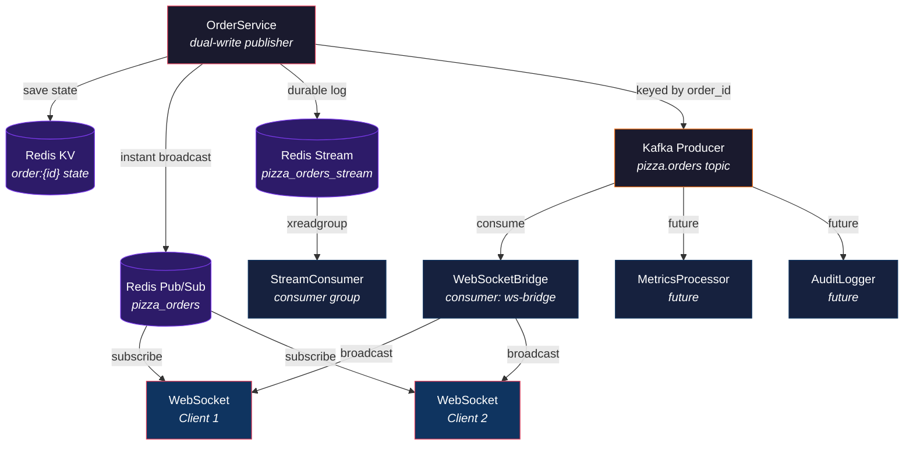
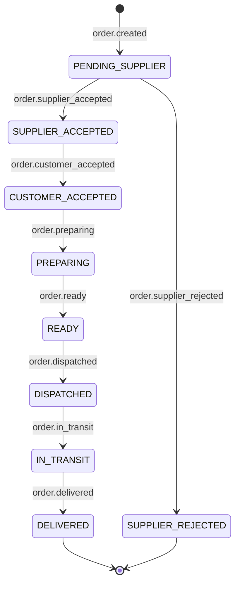

# Kafka / Redpanda Integration — Hands-On Experience

This document provides a **practical, step-by-step experience** for the Kafka integration in the event-driven pizza delivery platform. Every section is designed to be executed live — copy the commands, run them, and observe the results.

---

## What You'll Experience

| Step | Topic | Time | What You'll Do |
|------|-------|------|----------------|
| 1 | Start the Stack | 2 min | Boot Redis + Redpanda + Backend + Frontend |
| 2 | First Event | 3 min | Create an order, watch it appear in Kafka |
| 3 | Dual-Write Verification | 5 min | Confirm same event in Redis and Kafka |
| 4 | WebSocket Bridge | 5 min | See Kafka events broadcast to browser in real-time |
| 5 | Full Order Lifecycle | 10 min | Walk through all 6 state transitions |
| 6 | Fault Tolerance | 10 min | Kill Kafka, prove app survives |
| 7 | Scalability | 10 min | Scale consumers, watch partition rebalancing |
| 8 | Consumer Groups | 10 min | Add a second consumer, see independent offsets |
| 9 | Build Your Own Consumer | 15 min | Write a Python script to consume and process events |
| 10 | Monitoring | 5 min | Inspect topic health, consumer lag, message format |

**Total time: ~75 minutes**

---

## Prerequisites

- Docker and Docker Compose installed
- `curl` available in terminal
- A web browser (for WebSocket demo)
- Python 3.11+ (for Step 9)

---

## Step 1: Start the Stack (2 minutes)

### 1.1 Clone and Navigate

```bash
git clone https://github.com/yourusername/event-driven-platform.git
cd event-driven-platform
```

### 1.2 Start All Services

```bash
docker compose up -d
```

Expected output:
```
[+] Running 4/4
 ✔ Network event-driven-platform_default    Created
 ✔ Container event-driven-platform-redis-1  Started
 ✔ Container event-driven-platform-redpanda-1 Started
 ✔ Container event-driven-platform-backend-1  Started
 ✔ Container event-driven-platform-frontend-1 Started
```

### 1.3 Verify Everything Is Running

```bash
docker compose ps
```

Expected output:
```
NAME                        STATUS      PORTS
event-driven-platform-redis-1       Up  ...    0.0.0.0:6379->6379/tcp
event-driven-platform-redpanda-1    Up  ...    0.0.0.0:9092->9092/tcp
event-driven-platform-backend-1     Up  ...    0.0.0.0:8000->8000/tcp
event-driven-platform-frontend-1    Up  ...    0.0.0.0:5173->5173/tcp
```

### 1.4 Create the Kafka Topic

```bash
docker compose exec redpanda rpk topic create pizza.orders --partitions 3
```

Expected output:
```
TOPIC        STATUS
pizza.orders  OK
```

### 1.5 Verify the Backend Is Healthy

```bash
curl -s http://localhost:8000/health | python3 -m json.tool
```

Expected output:
```json
{
    "status": "healthy",
    "timestamp": "2026-07-13T12:00:00"
}
```

**Checkpoint:** All 4 services are running. Kafka topic is created. Backend is healthy.

---

## Step 2: First Event in Kafka (3 minutes)

### 2.1 Start a Kafka Consumer (Terminal 1)

Open a new terminal and run:

```bash
docker compose exec redpanda rpk topic consume pizza.orders --num 1
```

This command waits for 1 event and prints it. It will block until an event arrives.

### 2.2 Create an Order (Terminal 2)

Open another terminal and run:

```bash
curl -s -X POST http://localhost:8000/api/orders \
  -H "Content-Type: application/json" \
  -d '{
    "supplier_name": "Pizza Palace",
    "pizza_name": "Margherita",
    "supplier_price": 10.0,
    "markup_percentage": 30.0
  }' | python3 -m json.tool
```

Expected output:
```json
{
    "event_type": "order.created",
    "order": {
        "id": "a1b2c3d4-...",
        "tracking_id": "PIZZA-2026-123456",
        "supplier_name": "Pizza Palace",
        "pizza_name": "Margherita",
        "supplier_price": 10.0,
        "customer_price": 13.0,
        "markup_percentage": 30.0,
        "status": "pending_supplier",
        ...
    },
    "timestamp": "2026-07-13T12:00:00.000000"
}
```

### 2.3 Check Terminal 1 (Kafka Consumer)

The consumer should now show the event:

```json
{
    "topic": "pizza.orders",
    "key": "a1b2c3d4-...",
    "value": {
        "event_type": "order.created",
        "order": {
            "id": "a1b2c3d4-...",
            "tracking_id": "PIZZA-2026-123456",
            "supplier_name": "Pizza Palace",
            "pizza_name": "Margherita",
            ...
        },
        "timestamp": "2026-07-13T12:00:00.000000"
    },
    "partition": 0,
    "offset": 0
}
```

**Checkpoint:** The event appeared in Kafka. Note the `key` is the order ID and `partition` is 0.

### 2.4 Verify Partitioning

Create another order and check which partition it lands on:

```bash
# Terminal 2: Create another order
curl -s -X POST http://localhost:8000/api/orders \
  -H "Content-Type: application/json" \
  -d '{"supplier_name":"Pizza Palace","pizza_name":"Pepperoni","supplier_price":12.0,"markup_percentage":25.0}' > /dev/null

# Terminal 1: Consume next event
docker compose exec redpanda rpk topic consume pizza.orders --num 1
```

Note the `partition` field — it may be 0, 1, or 2 depending on the order ID hash. All events for the SAME order always go to the SAME partition.

---

## Step 3: Dual-Write Verification (5 minutes)

This step proves that every event goes to **both** Redis and Kafka simultaneously.

### 3.1 Check Redis KV (Order State)

```bash
# List all order keys
docker compose exec redis redis-cli KEYS "order:*"
```

Expected output:
```
1) "order:a1b2c3d4-..."
2) "order:e5f6g7h8-..."
```

### 3.2 Read an Order from Redis

```bash
# Replace with your actual order ID from Step 2
docker compose exec redis redis-cli GET "order:a1b2c3d4-..." | python3 -m json.tool
```

Expected output:
```json
{
    "id": "a1b2c3d4-...",
    "tracking_id": "PIZZA-2026-123456",
    "supplier_name": "Pizza Palace",
    "pizza_name": "Margherita",
    "status": "pending_supplier",
    ...
}
```

### 3.3 Check Redis Streams (Durable Log)

```bash
# Count total events in stream
docker compose exec redis redis-cli XLEN pizza_orders_stream
```

Expected output:
```
(integer) 2
```

### 3.4 Read Redis Stream Events

```bash
# Read last 5 events
docker compose exec redis redis-cli XRANGE pizza_orders_stream - + COUNT 5
```

### 3.5 Check Kafka (Scalable Backbone)

```bash
# Describe topic
docker compose exec redpanda rpk topic describe pizza.orders
```

Expected output:
```
pizza.orders
  Partitions: 3
  Replicas: 1
  ...
```

### 3.6 Verify All Three Have the Same Data

```bash
# Redis KV count
echo "Redis orders: $(docker compose exec redis redis-cli KEYS 'order:*' | wc -l)"

# Redis Stream count
echo "Redis events: $(docker compose exec redis redis-cli XLEN pizza_orders_stream)"

# Kafka messages
echo "Kafka events: $(docker compose exec redpanda rpk topic describe pizza.orders | grep -o 'offset.*' | head -1)"
```

**Checkpoint:** Same events exist in Redis KV, Redis Streams, and Kafka. This is the dual-write pattern in action.

---

## Step 4: WebSocket Bridge (5 minutes)

This step proves that Kafka events are broadcast to browser clients in real-time via the WebSocketBridge.

### 4.1 Open Browser Console

Navigate to `http://localhost:5173` and open the browser Developer Console (F12).

### 4.2 Connect to WebSocket

Paste this in the console:

```javascript
const ws = new WebSocket('ws://localhost:8000/ws');
ws.onopen = () => console.log('WebSocket connected');
ws.onmessage = (e) => {
  const event = JSON.parse(e.data);
  console.log('Kafka event received:', event.event_type, event.order?.tracking_id);
};
ws.onerror = (e) => console.error('WebSocket error:', e);
ws.onclose = () => console.log('WebSocket closed');
```

Expected output:
```
WebSocket connected
```

### 4.3 Create an Order and Watch

```bash
# Terminal: Create an order
curl -s -X POST http://localhost:8000/api/orders \
  -H "Content-Type: application/json" \
  -d '{"supplier_name":"Pizza Palace","pizza_name":"Hawaiian","supplier_price":14.0,"markup_percentage":20.0}' > /dev/null
```

Check the browser console — you should see:
```
Kafka event received: order.created PIZZA-2026-789012
```

### 4.4 Verify It Came Through Kafka (Not Just Redis)

The WebSocketBridge consumes from Kafka's `ws-bridge` consumer group. To prove events are coming through Kafka:

```bash
# Check consumer group offsets
docker compose exec redpanda rpk group describe ws-bridge
```

Expected output:
```
GROUP         STATE    BALANCED  MEMBERS  OFFSET
ws-bridge     Stable   Yes       1        3
```

The offset increases each time a new event is consumed — confirming the WebSocket received it via Kafka.

**Checkpoint:** Kafka events are broadcast to the browser in real-time via WebSocketBridge.

---

## Step 5: Full Order Lifecycle (10 minutes)

Walk through all 6 state transitions and watch each one appear in Kafka.

### 5.1 Start a Persistent Kafka Consumer

```bash
# Terminal 1: Watch all events
docker compose exec redpanda rpk topic consume pizza.orders
```

### 5.2 Create an Order

```bash
curl -s -X POST http://localhost:8000/api/orders \
  -H "Content-Type: application/json" \
  -d '{"supplier_name":"Pizza Palace","pizza_name":"Margherita","supplier_price":10.0,"markup_percentage":30.0}'
```

Save the order ID from the response. You'll need it for the next commands.

```bash
# Set the order ID (replace with your actual ID)
ORDER_ID="your-order-id-here"
```

### 5.3 Supplier Accepts

```bash
curl -s -X POST "http://localhost:8000/api/orders/${ORDER_ID}/supplier-respond?accept=true&notes=Fresh+out+of+oven&estimated_time=25" \
  -H "Content-Type: application/json"
```

Kafka consumer shows: `order.supplier_accepted`

### 5.4 Customer Accepts

```bash
curl -s -X POST "http://localhost:8000/api/orders/${ORDER_ID}/customer-accept" \
  -H "Content-Type: application/json" \
  -d '{"customer_name":"Jane Doe","delivery_address":"456 Oak St"}'
```

Kafka consumer shows: `order.customer_accepted`

### 5.5 Dispatch Driver

```bash
curl -s -X POST "http://localhost:8000/api/orders/${ORDER_ID}/dispatch" \
  -H "Content-Type: application/json" \
  -d '{"driver_name":"Driver Dave"}'
```

Kafka consumer shows: `order.dispatched`

### 5.6 Mark In Transit

```bash
curl -s -X POST "http://localhost:8000/api/orders/${ORDER_ID}/status?status=in_transit"
```

Kafka consumer shows: `order.in_transit`

### 5.7 Mark Delivered

```bash
curl -s -X POST "http://localhost:8000/api/orders/${ORDER_ID}/status?status=delivered"
```

Kafka consumer shows: `order.delivered`

### 5.8 Verify Complete Event Sequence

You should have seen 6 events in the Kafka consumer:

```
1. order.created          → partition 0, offset 3
2. order.supplier_accepted → partition 0, offset 4
3. order.customer_accepted → partition 0, offset 5
4. order.dispatched        → partition 0, offset 6
5. order.in_transit        → partition 0, offset 7
6. order.delivered         → partition 0, offset 8
```

**All 6 events landed on the same partition** (partition 0) because they share the same order ID key. This is the partitioning guarantee.

**Checkpoint:** Complete order lifecycle with all events visible in Kafka.

---

## Step 6: Fault Tolerance (10 minutes)

Prove that Kafka failures never break the application.

### 6.1 Scenario: Kafka Goes Down

```bash
# Terminal 1: Stop Kafka
docker compose stop redpanda
```

### 6.2 Create an Order Without Kafka

```bash
# Terminal 2: Create an order — still works!
curl -s -X POST http://localhost:8000/api/orders \
  -H "Content-Type: application/json" \
  -d '{"supplier_name":"Pizza Palace","pizza_name":"Pepperoni","supplier_price":12.0,"markup_percentage":25.0}' | python3 -m json.tool
```

Expected output — **the order is still created successfully**:
```json
{
    "event_type": "order.created",
    "order": {
        "id": "...",
        "status": "pending_supplier",
        ...
    }
}
```

### 6.3 Check Backend Logs

```bash
docker compose logs backend --tail 20
```

You should see:
```
WARNING: Kafka publish failed (non-blocking): ...
```

The warning confirms Kafka failed but the app continued.

### 6.4 Verify Redis Still Has the Event

```bash
# Redis KV
docker compose exec redis redis-cli KEYS "order:*"

# Redis Stream
docker compose exec redis redis-cli XLEN pizza_orders_stream
```

The event is in Redis — the app didn't lose data.

### 6.5 Restart Kafka

```bash
docker compose start redpanda
```

### 6.6 Verify Kafka Works Again

```bash
# Create another order
curl -s -X POST http://localhost:8000/api/orders \
  -H "Content-Type: application/json" \
  -d '{"supplier_name":"Pizza Palace","pizza_name":"Hawaiian","supplier_price":14.0,"markup_percentage":20.0}' > /dev/null

# Watch Kafka events
docker compose exec redpanda rpk topic consume pizza.orders --num 1
```

**Key insight:** The app never went down. Redis handled the outage gracefully. Kafka was just an optional enhancement that resumed automatically.

---

## Step 7: Scalability (10 minutes)

Prove horizontal scaling with multiple consumers.

### 7.1 Single Consumer (Baseline)

```bash
# Start one backend instance
docker compose up -d backend

# Create 10 orders
for i in {1..10}; do
  curl -s -X POST http://localhost:8000/api/orders \
    -H "Content-Type: application/json" \
    -d "{\"supplier_name\":\"Pizza Palace\",\"pizza_name\":\"Order $i\",\"supplier_price\":10.0,\"markup_percentage\":30.0}" &
done
wait

# Check consumer group lag
docker compose exec redpanda rpk group describe ws-bridge
```

### 7.2 Multiple Consumers (Scaled)

```bash
# Scale backend to 3 instances
docker compose up -d --scale backend=3

# Kafka automatically rebalances partitions across instances
# Instance A handles partitions 0, 1
# Instance B handles partition 2
# Instance C waits as standby

# Check consumer group — shows 3 members
docker compose exec redpanda rpk group describe ws-bridge
```

**Key insight:** Kafka partitions are distributed across consumers in the group. Each consumer processes a subset of events, enabling horizontal scaling without changing application code.

---

## Step 8: Consumer Groups (10 minutes)

Add a second consumer group and see independent offset tracking.

### 8.1 Create a Custom Consumer

Save this as `custom_consumer.py`:

```python
import json
from aiokafka import AIOKafkaConsumer

async def main():
    consumer = AIOKafkaConsumer(
        "pizza.orders",
        bootstrap_servers="localhost:9092",
        group_id="analytics-team",
        value_deserializer=lambda m: json.loads(m.decode()),
        auto_offset_reset="earliest",
    )
    await consumer.start()
    print("Analytics consumer started. Listening for events...")

    try:
        async for msg in consumer:
            event = msg.value
            print(f"[Analytics] {event['event_type']} | order: {event.get('order', {}).get('id', 'N/A')[:8]}")
    finally:
        await consumer.stop()

if __name__ == "__main__":
    import asyncio
    asyncio.run(main())
```

### 8.2 Run the Custom Consumer

```bash
# Install aiokafka if needed
pip install aiokafka

# Run the consumer
python custom_consumer.py
```

### 8.3 Create Orders and Watch Both Consumers

```bash
# Terminal 3: Create an order
curl -s -X POST http://localhost:8000/api/orders \
  -H "Content-Type: application/json" \
  -d '{"supplier_name":"Pizza Palace","pizza_name":"Margherita","supplier_price":10.0,"markup_percentage":30.0}' > /dev/null
```

You should see output in:
- **Terminal 1:** `rpk topic consume` (raw Kafka output)
- **Terminal 2:** `ws-bridge` consumer group (WebSocket broadcast)
- **Terminal 3:** Custom `analytics-team` consumer (your script)

### 8.4 Verify Independent Offsets

```bash
# Check all consumer groups
docker compose exec redpanda rpk group list

# Check analytics-team offset
docker compose exec redpanda rpk group describe analytics-team

# Check ws-bridge offset
docker compose exec redpanda rpk group describe ws-bridge
```

Each group tracks its own offset independently. The `analytics-team` consumer can read from the beginning (`earliest`) while `ws-bridge` only reads new events (`latest`).

---

## Step 9: Build Your Own Consumer (15 minutes)

Write a Python script that processes Kafka events and stores them in a file.

### 9.1 Create the Consumer Script

Save this as `event_archiver.py`:

```python
import json
import asyncio
from datetime import datetime
from aiokafka import AIOKafkaConsumer

ARCHIVE_FILE = "events_archive.jsonl"

async def main():
    consumer = AIOKafkaConsumer(
        "pizza.orders",
        bootstrap_servers="localhost:9092",
        group_id="event-archiver",
        value_deserializer=lambda m: json.loads(m.decode()),
        auto_offset_reset="earliest",
    )
    await consumer.start()
    print(f"Event archiver started. Writing to {ARCHIVE_FILE}")

    try:
        async for msg in consumer:
            event = msg.value
            event["_kafka"] = {
                "topic": msg.topic,
                "partition": msg.partition,
                "offset": msg.offset,
                "archived_at": datetime.utcnow().isoformat(),
            }

            with open(ARCHIVE_FILE, "a") as f:
                f.write(json.dumps(event, default=str) + "\n")

            print(f"Archived: {event['event_type']} | partition={msg.partition} offset={msg.offset}")
    finally:
        await consumer.stop()

if __name__ == "__main__":
    asyncio.run(main())
```

### 9.2 Run the Archiver

```bash
python event_archiver.py
```

### 9.3 Create Events and Verify Archival

```bash
# Create a few orders
for i in {1..3}; do
  curl -s -X POST http://localhost:8000/api/orders \
    -H "Content-Type: application/json" \
    -d "{\"supplier_name\":\"Pizza Palace\",\"pizza_name\":\"Pizza $i\",\"supplier_price\":10.0,\"markup_percentage\":30.0}" > /dev/null
done

# Check the archive file
cat events_archive.jsonl | python3 -m json.tool
```

### 9.4 Verify the Archive Has All Events

```bash
# Count archived events
wc -l events_archive.jsonl

# Show event types
cat events_archive.jsonl | python3 -c "
import sys, json
for line in sys.stdin:
    event = json.loads(line)
    print(f\"{event['event_type']} | partition={event['_kafka']['partition']} offset={event['_kafka']['offset']}\")
"
```

**Checkpoint:** You've built a custom Kafka consumer that archives events to a file. This same pattern applies to databases, Elasticsearch, S3, or any other sink.

---

## Step 10: Monitoring (5 minutes)

Inspect topic health, consumer lag, and message format.

### 10.1 Topic Health

```bash
# List all topics
docker compose exec redpanda rpk topic list

# Describe topic details
docker compose exec redpanda rpk topic describe pizza.orders

# Check topic configuration
docker compose exec redpanda rpk topic describe pizza.orders -d
```

### 10.2 Consumer Group Status

```bash
# List all consumer groups
docker compose exec redpanda rpk group list

# Describe ws-bridge group
docker compose exec redpanda rpk group describe ws-bridge

# Describe analytics-team group (if running)
docker compose exec redpanda rpk group describe analytics-team
```

### 10.3 Consumer Lag

```bash
# Check lag for each consumer group
docker compose exec redpanda rpk group describe ws-bridge | grep -A 5 "PARTITION"
```

Consumer lag shows how many messages are pending. Zero lag means the consumer is caught up.

### 10.4 Message Format Inspection

```bash
# Consume last 3 events with full metadata
docker compose exec redpanda rpk topic consume pizza.orders --num 3
```

Each message shows:
- `topic` — which topic it came from
- `key` — the order ID (partition key)
- `value` — the full event JSON
- `partition` — which partition it landed on
- `offset` — the position within the partition

### 10.5 Producer Metrics

```bash
# Check broker metrics
docker compose exec redpanda rpk cluster health

# Check partition distribution
docker compose exec redpanda rpk topic describe pizza.orders
```

---

## Architecture Reference

### Dual-Write Event Bus



### Kafka Topic Design

| Topic          | Partitions | Key         | Retention     | Purpose                      |
|----------------|------------|-------------|---------------|------------------------------|
| `pizza.orders` | 3          | `order_id`  | 7 days        | All order lifecycle events   |

**Partitioning by `order_id`** ensures all events for a single order land on the same partition, preserving order.

### Message Format

Each Kafka message is a JSON object (the same structure used by Redis Pub/Sub and Streams):

```json
{
  "event_type": "order.created",
  "order": {
    "id": "uuid-string",
    "tracking_id": "PIZZA-2026-001234",
    "supplier_name": "Pizza Palace",
    "pizza_name": "Margherita",
    "supplier_price": 10.0,
    "customer_price": 13.0,
    "markup_percentage": 30.0,
    "status": "pending_supplier",
    "customer_name": null,
    "delivery_address": null,
    "driver_name": null,
    "estimated_delivery_time": null,
    "supplier_notes": null,
    "created_at": "2026-07-08T12:00:00",
    "updated_at": "2026-07-08T12:00:00"
  },
  "timestamp": "2026-07-08T12:00:00.000000",
  "correlation_id": null
}
```

---

## Redis vs Kafka — Why Both?

| Capability | Redis Pub/Sub | Redis Streams | Kafka/Redpanda |
|------------|--------------|---------------|----------------|
| **Delivery** | Fire-and-forget | At-least-once | At-least-once |
| **Replay** | No | Yes (by ID) | Yes (by offset) |
| **Retention** | None | Configurable | Configurable (days/weeks) |
| **Consumer Groups** | No | Yes | Yes (with rebalancing) |
| **Partitioning** | No | No | Key-based partitioning |
| **Horizontal Scale** | No | Limited | Multi-broker, partition rebalancing |
| **Ecosystem** | Minimal | Minimal | Kafka Connect, ksqlDB, Streams API |
| **Latency** | ~1ms | ~1ms | ~5ms (local), ~50ms (cloud) |

**Answer:** Redis provides instant, low-latency broadcast for WebSocket clients. Kafka provides durable, scalable, replayable event storage for analytics, audit, and future consumers. The dual-write pattern gives both without sacrificing either.

---

## Code Walkthrough — Annotated Key Snippets

### Dual-Write Pattern (Non-Blocking)

The critical design decision: Kafka failures must never block the application.

```python
# services/order_service.py — _publish_event()

async def _publish_event(self, event: OrderEvent):
    event_data = event.model_dump(mode='json')

    # 1. ALWAYS publish to Redis (instant broadcast + persistence)
    await self.redis.publish("pizza_orders", json.dumps(event_data))
    await self.redis.add_to_stream("pizza_orders_stream", stream_data)

    # 2. OPTIONALLY publish to Kafka (non-blocking on failure)
    if self.kafka:
        try:
            await self.kafka.publish_event(event_data)
        except Exception as e:
            # Log warning but DO NOT raise — app continues via Redis
            logger.warning("Kafka publish failed (non-blocking): %s", e)
```

**Why non-blocking?** If Kafka is down (broker unreachable, network partition), the order still gets created, WebSocket clients still receive updates via Redis Pub/Sub, and the event is persisted in Redis Streams. Kafka can catch up later.

### Partitioning Strategy

```python
# services/kafka_service.py — publish_event()

async def publish_event(self, event_data: dict):
    order_id = event_data.get("order", {}).get("id")
    await self.producer.send(
        topic=self.topic,
        key=order_id,          # <-- Partition key
        value=event_data,
    )
```

**Why `order_id` as key?** Kafka hashes the key to determine which partition receives the message. This guarantees all events for the same order land on the same partition, preserving per-order ordering. If you used no key (or a random key), events for the same order could end up on different partitions and arrive out of order.

### Auto-Reconnect Bridge

```python
# services/kafka_service.py — broadcast_loop()

async def broadcast_loop(self):
    try:
        async for msg in self.consumer:
            if not self.running:
                break
            for ws in list(self.connections):
                try:
                    await ws.send_text(json.dumps(msg.value))
                except Exception:
                    # Dead connection — remove silently
                    self.connections.discard(ws)
    except Exception as e:
        logger.error("WebSocket bridge error: %s", e)
        if self.running:
            await asyncio.sleep(5)       # Backoff before retry
            asyncio.create_task(self.broadcast_loop())  # Auto-restart
```

**Three resilience features in one loop:**
1. Dead WebSocket cleanup (don't crash on one bad client)
2. Error recovery with 5-second backoff (don't hammer the broker)
3. Graceful shutdown via `self.running` flag

---

## Configuration

### Environment Variables

| Variable                   | Default        | Description                              |
|----------------------------|----------------|------------------------------------------|
| `KAFKA_BOOTSTRAP_SERVERS`  | _(empty)_      | Kafka broker address (e.g., `localhost:9092`). Leave empty to disable Kafka. |
| `KAFKA_TOPIC`              | `pizza.orders` | Topic name for order events              |

Set in `backend/.env`:

```env
KAFKA_BOOTSTRAP_SERVERS=localhost:9092
KAFKA_TOPIC=pizza.orders
```

### Settings Class (`config.py`)

```python
class Settings(BaseSettings):
    ...
    kafka_bootstrap_servers: Optional[str] = None
    kafka_topic: str = "pizza.orders"
```

---

## Consumer Groups

Kafka consumer groups enable independent offset management. Each group receives every message, allowing different downstream processing:

| Consumer Group    | Purpose                       | auto.offset.reset | Created By        |
|-------------------|-------------------------------|-------------------|-------------------|
| `ws-bridge`       | WebSocket real-time broadcast | `latest`          | `WebSocketBridge` |
| `analytics-team`  | Custom analytics (Step 8)     | `earliest`        | Your script       |
| `event-archiver`  | File archival (Step 9)        | `earliest`        | Your script       |
| *(future)* `metrics-processor` | Prometheus/Grafana metrics | `earliest`        | —                 |
| *(future)* `audit-log`        | Durable logging / archival    | `earliest`        | —                 |

Adding new groups requires no topic changes — just start a new consumer with the desired `group_id`.

---

## Event Flow (State Transitions)

Each order state transition publishes a distinct event type to Kafka:



All are published to the same `pizza.orders` topic, keyed by `order_id` for per-order ordering.

---

## Migration from Redis Streams

### Phase 1 — Dual Write (current)

Events are published to both Redis Streams and Kafka. Both systems operate in parallel:

- Redis Streams + `StreamConsumer` continue processing
- Kafka producers and `WebSocketBridge` run alongside
- Verify Kafka receives identical events

### Phase 2 — Kafka Primary

- Move `MetricsService` to read from Kafka instead of Redis Streams
- Add additional consumer groups for notifications, analytics
- Verify all downstream consumers work correctly

### Phase 3 — Retire Redis Streams

- Remove Redis Pub/Sub publishing from `_publish_event()`
- Remove `StreamConsumer` and related code
- Redis KV (`order:{id}`) and cache remain unchanged

---

## Testing the Integration

### Unit Tests

```bash
cd backend
python -m pytest tests/test_kafka_integration.py -v
```

The test suite covers:

| Test                                      | What it verifies                                    |
|-------------------------------------------|-----------------------------------------------------|
| `test_kafka_service_start_stop`           | Producer lifecycle (start/stop)                     |
| `test_kafka_service_publish_event`        | Single event publish with correct topic/key/value   |
| `test_kafka_service_publish_multiple_events` | Batch event publish count                        |
| `test_kafka_service_publish_empty_events` | Handling empty event list                           |
| `test_kafka_service_publish_error_handling` | Graceful handling of producer failures            |
| `test_order_service_publishes_to_kafka`   | End-to-end: `OrderService` -> Kafka publish          |
| `test_order_service_skips_kafka_when_not_configured` | Kafka is optional, works without it |
| `test_order_service_full_lifecycle_publishes_to_kafka` | All state transitions publish to Kafka |
| `test_order_service_kafka_failure_does_not_block_redis` | Kafka failure is non-blocking |
| `test_order_service_batch_publishes_to_kafka` | Batch dispatch publishes to Kafka               |
| `test_websocket_bridge_connections`       | Add/remove connections, broadcast                   |
| `test_websocket_bridge_multiple_connections` | Broadcast to multiple connected clients          |
| `test_websocket_bridge_removes_disconnected_clients` | Cleanup dead connections          |
| `test_websocket_bridge_error_recovery`    | broadcast_loop restarts on consumer error           |
| `test_websocket_bridge_consumer_configuration` | Consumer group, offset reset settings        |

Tests use mocked `AIOKafkaProducer` and `AIOKafkaConsumer` — no real Kafka broker required.

### Manual End-to-End Test

```bash
# Terminal 1: Start Redpanda + app
docker compose up -d

# Terminal 2: Watch events
docker compose exec redpanda rpk topic consume pizza.orders

# Terminal 3: Create an order
curl -X POST http://localhost:8000/api/orders \
  -H "Content-Type: application/json" \
  -d '{"supplier_name":"Pizza Palace","pizza_name":"Margherita","supplier_price":10.0,"markup_percentage":30.0}'
```

---

## Monitoring and Operations

### Topic Health

```bash
# List topics
docker compose exec redpanda rpk topic list

# Describe topic
docker compose exec redpanda rpk topic describe pizza.orders

# Check consumer group status
docker compose exec redpanda rpk group describe ws-bridge
```

### Metrics to Watch

- **Producer request rate** — events/second published
- **Consumer lag** — unprocessed messages per consumer group
- **Partition count** — should match expected distribution
- **Message size** — ensure stays within limits

### Troubleshooting

| Symptom                          | Likely Cause                         | Fix                                      |
|----------------------------------|--------------------------------------|------------------------------------------|
| WebSocket clients not receiving events | Kafka not started / wrong bootstrap | Check `KAFKA_BOOTSTRAP_SERVERS` env var |
| Producer fails to connect        | Redpanda not running                 | `docker compose up -d redpanda`          |
| Duplicate events on WebSocket    | Both Kafka bridge + Redis Pub/Sub active | Phase 3: retire Redis Pub/Sub       |
| Consumer group rebalancing       | Instances starting/stopping          | Normal; verify partition count           |
| High consumer lag                | Consumer too slow                    | Increase partitions or app instances     |

---

## Performance Considerations

### Partition Count

- Start with 3 partitions for the demo platform
- Rule of thumb: at least as many partitions as expected concurrent consumers
- More partitions = more parallelism but more overhead

### Message Size

- Current events average 500-800 bytes
- Kafka default max message size is 1 MB (no changes needed)

### Retention

- 7-day time-based retention is configured by default
- For the demo, infinite retention is also acceptable (low volume)
- Use compaction if only the latest state per order matters

### Consumer Design

- `WebSocketBridge` uses `enable_auto_commit=True` for simplicity
- For at-least-once processing (metrics, audit), use manual commits
- The `broadcast_loop` auto-restarts on error with a 5-second delay

---

## Future Enhancements

- **Schema Registry** — Add Confluent Schema Registry + Avro/Protobuf for schema evolution
- **Kafka Connect** — Sink events to Elasticsearch, S3, or a time-series DB
- **Kafka Streams / ksqlDB** — Real-time aggregations (orders per supplier, delivery times)
- **Dead Letter Queue** — Route failed events to a `pizza.orders.dlq` topic
- **Idempotent Producer** — Enable `enable.idempotence=true` for exactly-once semantics
- **Tiered Storage** — Redpanda supports object store tiering for long retention
